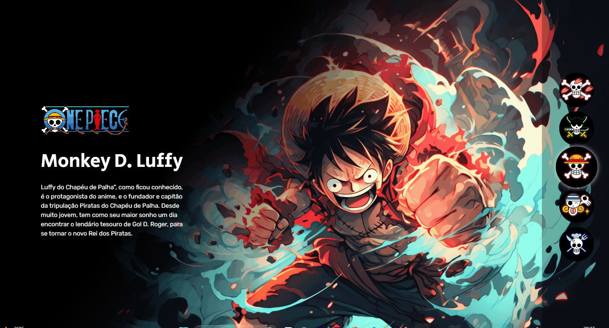

# Projeto One Piece
um projeto de teste com um arquivo README 🚀

[](https://iagob-jesus.github.io/projeto-one-piece/)

## Tecnologias utilizadas
- HTML
- CSS
- JS
## Como utilizar

1 - Clone pro o projeto
```
git clone <url>
```

2 - Acesse a pasta do projeto
```
cd repositorio-com-readme
```